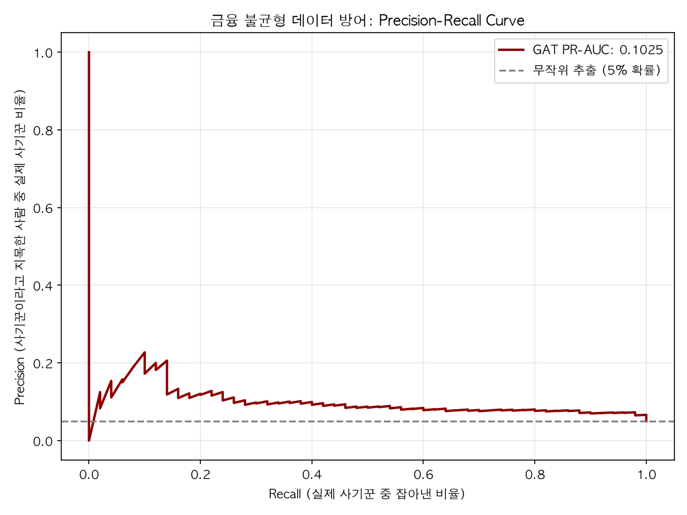

# Spatial Graph Mapping for AML Blind-Spot Detection 서강경제 김유정

## 📌 프로젝트 개요 (Project Overview)
본 프로젝트는 기존 룰베이스(Rule-based) FDS(이상거래탐지시스템)가 놓치는 자금세탁(AML)의 사각지대_Blind-Spot를 찾아내기 위해 기획되었습니다. 
3D 컴퓨터 비전(DUSt3R)의 물리적 공간 스캔 개념인 '가시성(Visibility)'과 '차단(Occlusion)'을 금융 결제 네트워크에 이식하여, 자금의 은닉 및 순환 구조를 3차원 그래프 임베딩으로 시각화하고 탐지하는 하이브리드 아키텍처를 제안합니다.

## 🚀 핵심 아키텍처 및 기술적 기여
1. 도메인 전이(Cross-Domain Transfer): 공간 스캔 알고리즘을 활용해 PageRank(가시성)와 Louvain 커뮤니티(차단율) 지표를 융합하여 새로운 리스크 지표 창출.
2. Confidence-Aware GNN (GATv2): 정답 라벨(Label)이 부족한 실무 환경을 반영하여, 비지도 학습(Autoencoder)으로 정상 거래 패턴을 학습하고 재건 오차(Reconstruction Error)를 엣지(Edge)의 신뢰도로 동적 할당.
3. 극단적 데이터 불균형 방어: Focal Loss를 적용하여 극소수의 이상 거래(Anomaly) 탐지에 집중하며, ROC-AUC의 착시를 배제한 PR-AUC(Precision-Recall) 지표를 통해 실무적 타당성 검증.
4. 글로벌 금융 규제 대응 (XAI): GNNExplainer를 도입하여 모델의 판단 근거(Sub-graph 중요도)를 추출, 2026년 발효될 EU AI Act의 고위험 AI 감사가능성(Auditability) 요구사항 충족.

---

## 📊 프로젝트 시각화 대시보드 (Visual Analytics)

### 1. 자금세탁 의심 순환 네트워크 탐지 (Spatial Mapping)
PageRank 기반의 자금 쏠림 현상을 위험도로 환산하여, 정상적인 선형 거래와 자금세탁 의심 순환(Ring) 거래 패턴을 시각적으로 분리해 냅니다.


### 2. 금융 사기 탐지 핵심 지표: PR-AUC 성능 검증
극단적인 데이터 불균형(Imbalanced Data) 환경에서, 모델이 실제 사기 거래를 얼마나 정확하게 짚어내는지 보여주는 가장 보수적이고 확실한 평가 지표입니다.


### 3. GNN vs Baseline 탐지 성능 비교
기존의 머신러닝 방식(RandomForest)과, 신뢰도 가중치를 명시적으로 반영한 Graph Attention Network(GATv2)의 예측 성능 비교 결과입니다.


### 4. GNNExplainer 기반 설명 안정성 (감사가능성 증명)
단순한 탐지 성능을 넘어, AI가 특정 거래를 왜 '사기'로 분류했는지 근거를 시각화합니다. (노드 설명 안정성 지수 확보)


---

## 💻 실행 및 설치 방법 (Quick Start)
```bash
# 필수 라이브러리 설치
pip install torch torch_geometric scikit-learn pandas numpy matplotlib

# 1. 공간 매핑 및 기본 분석 실행
python3 spatial_graph_mapping.py

# 2. 신뢰도 인지 GAT 모델 및 설명가능성 검증
python3 gnn_aml_detector.py

# 3. 비지도학습/Focal Loss 기반 고도화 파이프라인 (PR-AUC 추출)
python3 advanced_aml_pipeline.py
